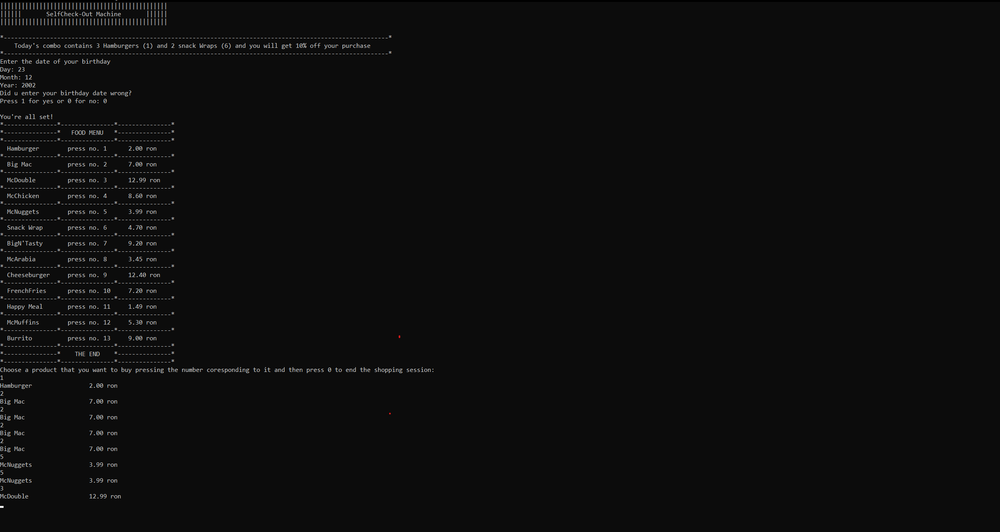
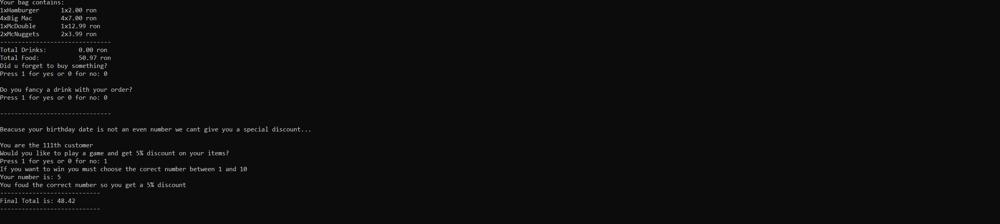

# Self-CheckOut Machine

## Overview

The Self-Checkout Simulation Program is a C-based software application designed to replicate the functionality of self-checkout systems commonly found in retail settings. Operating within a terminal interface, the program offers users a menu-driven experience to select food and drink items, calculate prices, apply discounts, and participate in a guessing game for additional benefits.

## Preview
#### Menu

#### CheckOut


## Getting Started

### Prerequisites

- [CodeBlocks](https://www.codeblocks.org/downloads/)

### Installing
1. Clone the repository:
   ```bash
   git clone https://github.com/RadAntonio/SelfCheckout.git
   ```

## Contributing
Contributions are welcome and greatly appreciated. If you have suggestions for improving this application, please fork the repo and create a pull request or open an issue.

1. Fork the Project
2. Create your Feature Branch (`git checkout -b feature/AmazingFeature`)
3. Commit your Changes (`git commit -m 'Add some AmazingFeature'`)
4. Push to the Branch (`git push origin feature/AmazingFeature`)
5. Open a Pull Request

## License
This project is licensed under the MIT License - see the [LICENSE](LICENSE) file for details.